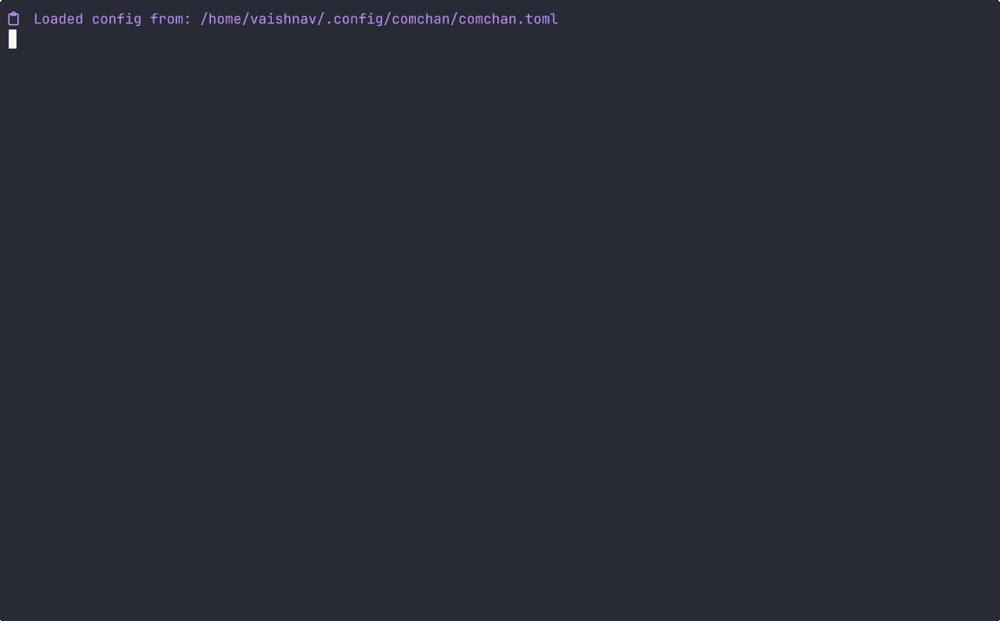
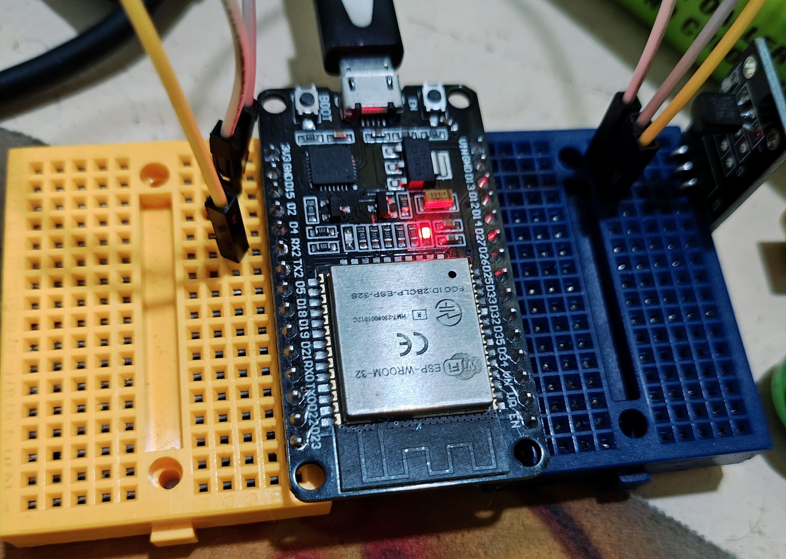

# DS18B20 Temperature sensor

## Output

### Serial Monitor



### Hardware



## Code

```rust
use esp_idf_svc::hal::gpio::PinDriver;
use esp_idf_svc::hal::delay::Delay;
use esp_idf_svc::hal::peripherals::Peripherals;
use esp_idf_svc::sys::EspError;
use one_wire_bus::OneWire;
use ds18b20::{Ds18b20, Resolution};

fn main() {
    esp_idf_svc::sys::link_patches();
    esp_idf_svc::log::EspLogger::initialize_default();
    
    let peripherals = Peripherals::take().unwrap();
    let pin = PinDriver::input_output_od(peripherals.pins.gpio4).unwrap();
    let mut delay = Delay::new_default();
    let mut one_wire = OneWire::new(pin).unwrap();
    
    log::info!("Searching for DS18B20 sensors...");
    
    // Search for devices
    let mut sensors = Vec::new();
    for device_address in one_wire.devices(false, &mut delay) {
        let address = device_address.unwrap();
        log::info!("Found device: {:?}", address);
        
        // Specify EspError as the generic error type parameter
        match Ds18b20::new::<EspError>(address) {
            Ok(sensor) => sensors.push(sensor),
            Err(e) => log::error!("Failed to create sensor: {:?}", e),
        }
    }
    
    if sensors.is_empty() {
        log::error!("No DS18B20 sensors found!");
        return;
    }
    
    log::info!("Found {} DS18B20 sensor(s)", sensors.len());
    
    // Main loop
    loop {
        // Start temperature conversion for all sensors
        ds18b20::start_simultaneous_temp_measurement(&mut one_wire, &mut delay).unwrap();
        
        // Wait for conversion (750ms for 12-bit resolution)
        delay.delay_ms(Resolution::Bits12.max_measurement_time_millis().into());
        
        // Read each sensor
        for (i, sensor) in sensors.iter().enumerate() {
            match sensor.read_data(&mut one_wire, &mut delay) {
                Ok(data) => {
                    log::info!("Sensor {}: {:.2}°C", i, data.temperature);
                }
                Err(e) => {
                    log::error!("Sensor {}: Error - {:?}", i, e);
                }
            }
        }
        
        delay.delay_ms(1000);
    }
}
```
