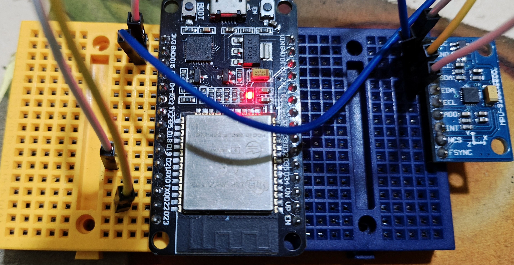

# MPU9250 `std`

## Outputs 

### Serial Monitor


### Hardware



## Code

```rust
use esp_idf_svc::hal::{
    delay::Delay,
    i2c::*,
    peripherals::Peripherals,
    prelude::*
};
use hayasen::mpu9250_hayasen;
use anyhow::Result;
use log::{
    info, 
    error
};

const DEVICE_ADDR: u8 = 0x68;

fn main() -> Result<()> {
    esp_idf_svc::sys::link_patches();

    esp_idf_svc::log::EspLogger::initialize_default();

    let peripherals = Peripherals::take()?;

    let sda = peripherals.pins.gpio21;
    let scl = peripherals.pins.gpio22;

    let delay = Delay::new_default();

    let config = I2cConfig::new().baudrate(100.kHz().into());

    let i2c = I2cDriver::new(
        peripherals.i2c0,
        sda,
        scl,
        &config,
    )?;

    let mut sensor = mpu9250_hayasen::create_default(i2c, DEVICE_ADDR).unwrap();

    loop {
        match mpu9250_hayasen::read_all(&mut sensor) {
            Ok((temp, accel, angular_velocity)) => {
                info!("Temperature : {:.2} C", temp);
                info!("Acceleration [X, Y, Z] : [{:.3}, {:.3}, {:.3}]", accel[0], accel[1], accel[2]);
                info!("Angular Velocity [X, Y, Z] : [{:.3}, {:.3}, {:.3}]", angular_velocity[0], angular_velocity[1], angular_velocity[2]);
            },
            Err(e) => {
                error!("Failed to read MPU9250 data : {:?}", e);
            }
        }
        delay.delay_ms(500);
    }
}
```
